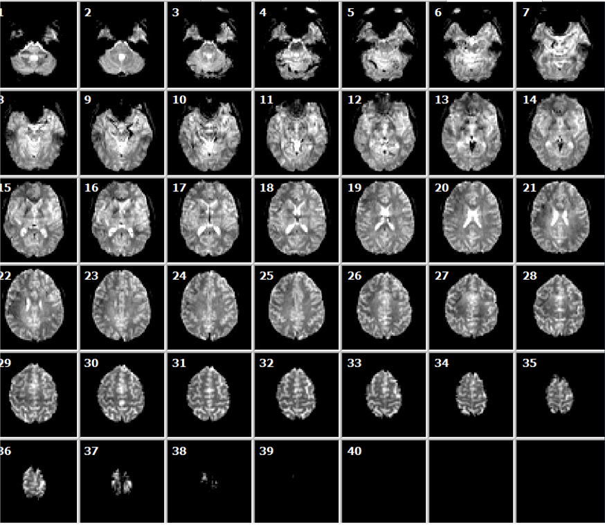

```{r setup, include=FALSE}
# Here you can place global options for the entire document.
# Mostly used for knitr settings, but can also load data etc.
# Whatever happens here will not show in the presentation.
knitr::opts_chunk$set(echo = TRUE,
                    out.width = "100%",
                    fig.retina = 3)

xaringanExtra::use_extra_styles(
  hover_code_line = TRUE
)

library(knitr)
library(dplyr)
library(kableExtra)
```

background-image: url("https://drmowinckels.io/about/profile.png")
background-position: right bottom
background-size: auto 100%
class: middle

.pull-left[
## Athanasia Monika Mowinckel

&nbsp;&nbsp;&nbsp;&nbsp;&nbsp;
[<i class="fa fa-twitter fa-2x" aria-hidden="true"></i>](https://twitter.com/DrMowinckels) 
[<i class="fa fa-github fa-2x" aria-hidden="true"></i>](https://github.com/Athanasiamo)
[<i class="fa fa-globe fa-2x" aria-hidden="true"></i>](https://drmowinckels.io/)

- Staff scientist  
- PhD in cognitive psychology  
- Software Carpentry Instructor  

]


---
background-image: url(https://www.lifebrain.uio.no/vrtx/decorating/resources/images/logo.png), url(https://www.lifebrain.uio.no/web-banner_rev.jpg), url(https://www.lifebrain.uio.no/vrtx/decorating/resources/images/eu-flag.jpg)
background-size: 50%, 100% auto, 10%
background-position: 50% 10%, bottom center, 90% 10% 

---

layout: true
    
<div class="my-sidebar"></div> 

---
background-image: url("img/mri_oven.png")
background-size: auto 100%
background-position: 100% 0%
class: middle, left

## MRI - the quick version

### Outline
- What is MRI 
- Modalities
  - T1 anat
  - DTI
  - Functional

???
We'll be doing a very quick introduction to MRI. 
This will get you a brief idea of what MRI is, what it measures and what we use it for in LCBC.
It's intent is to make you able to continue looking into what you might find interesting to dig deeper into on your own.

---
background-image: url("img/markus_mri.png")
background-position: right center
background-size: auto 100%

# What is MRI ?

.pull-left[
- Uses strong magnetic fields  
  - in clinical settings usually between 0.5T and 3T
  - human research is also done on up to 7T
- Measures density of hydrogen nuclei  
  - the magnetic field is changed exciting the nuclei by radio pulses 
  - images are created by measuring the rate of which excited nuclei return to the equilibrium state
]

---
background-image: url("https://secureservercdn.net/198.71.233.138/1x9.a09.myftpupload.com/wp-content/uploads/2014/11/3-9-hydrogen-nuclei-behave-as-tiny-bar-magnets-aligned-with-spin-axes-of-the-nuclei-spinning-protons.png")
background-size: 75%

.footnote[Image: [Fundamentals of Fluid Flow in Porous Media - Chpt. 3](https://perminc.com/resources/fundamentals-of-fluid-flow-in-porous-media/chapter-3-molecular-diffusion/diffusion-coefficient/measurement-techniques/nmr-method/principles-nmr-processing/)]


???
(a) Hydrogen Nuclei Behave as Tiny Bar Magnets Aligned with the Spin Axes of the Nuclei. (b) Spinning Protons with Random Nuclear Magnetic Axes in the Absence of an External Magnetic Field.
The difference between the numbers of protons with high and low energy level produces the bulk magnetization ‘M’, which provides signal measured by NMR devices (Figure 3‑10). The bulk (Macroscopic) magnetization ‘M’ is defined as the net magnetic moment per unit volume
 
---
background-image: url("https://secureservercdn.net/198.71.233.138/1x9.a09.myftpupload.com/wp-content/uploads/2014/11/3-10-line-up-nuclear-spins-in-external-magnetic-field.png")
background-size: 85%

.footnote[Image: [Fundamentals of Fluid Flow in Porous Media - Chpt. 3](https://perminc.com/resources/fundamentals-of-fluid-flow-in-porous-media/chapter-3-molecular-diffusion/diffusion-coefficient/measurement-techniques/nmr-method/principles-nmr-processing/)]

???
Line Up Nuclear Spins in an External Magnetic Field

M is measurable and is proportional to the number of protons, the magnitude B0 of the applied magnetic field, and the inverse of the absolute temperature.

After the protons are exposed to the static external magnetic field ( B0 ), they are said to be polarized. 

---
background-image: url("img/mri_voxel1.png"), url("img/mri_voxel2.png")
background-position: 15%, 95%
background-size: 45%

???
MR scanner can be looked at as an extremely advanced camera, which records signals from small, 3-dimensional voxels (volumetric pixels).

We can adjust the size of these voxels (within a small range).

---
background-image: url("img/mri_oven_px1.png"),url("img/mri_oven_px2.png"), url("img/mri_oven_px3.png"), url("img/mri_oven_px4.png")
background-position: 25% 5%, 85% 5%, 25% 95%, 85% 95%
background-size: 30%

???
Just like with digital images, the relationship between the full image and the pixels (or voxels) is the same. The more we zoom into a specific region the clearer the very specific components of the image becomes. And just like with black and white digital images, the mri images at their core are collections of voxels with varying degrees of white, black or grey. 
Its on these varying shades of grey that we do our analyses. 

---
class: dark
background-image: url("img/slices.png"), url("img/slices2.png")
background-position: 15% 85%, 95%
background-size: 30%, 60%


.left-column[
- _slices_
- collection of slices form a _volume_
]

???
to create 3d representation, we take a series of 2d images at different locations, and some fancy maths combines it all to a 3d object. 
Depending on the size of the slices and the number of them, the resolution of the end result changes.
The smaller the slice and the more of them, the better image we get at the end. 

A typical structural volume has a voxel size of 1mm3 and consists of over 1 million voxels.

---
class: dark
background-image: url("img/images.png")
background-size: 60%
background-position: 100% 

# Modalities
_Common for research_

**Structural**
- T1  
- T2  
- DTI

**Functional**
- Task
- Resting-state (rs)

.footnote[Image: [University of Wisconsin](https://sites.google.com/site/postgraduatetraining/image-acquisition/the-basics?tmpl=%2Fsystem%2Fapp%2Ftemplates%2Fprint%2F&showPrintDialog=1)]

???
In MRI we differentiate between different types of modalities, which mainly consist of different types of tissues being highlighted by the radio pulses.
Depending on the types of radio pulses, nuclei are excited in different ways, and therefore also their relaxation times also changes. 
This enables us to create images where we can better see different tissues. 

In structural Magnetic Resonance Imaging, we tune the scanner so that it is sensitive to static differences between tissue. Since the differences are static, we can spend several minutes to get one high-resolution volume.
In cognitive neuroscience, the tissues of interest are typically grey matter (neuronal cell bodies), and white matter (myelinated axons). 

In functional Magnetic Resonance Imaging (fMRI) we tune the scanner so that it is sensitive to dynamic differences, such as oxygen level in the blood.  
Since the differences of interest are dynamic, we collect as many volumes as possible during a given period of time (typically one volume every 2 seconds).

---
class: dark
background-image: url("img/mprage.png")
background-position: right
background-size:  auto 100%

## Structural - T1

.pull-left[
**MPRAGE / MEMPRAGE**
- Great resolution  
- Grey matter  
- Often combined with T2 during analyses to create better contrast between grey and white matter

.footnote[Image: [Siemens](https://www.siemens.com/global/en.html)]
]

---
class: dark
background-image: url("img/thickness_3.png")
background-position: right
background-size:  auto 80%

## Structural - T1

.pull-left[

**Cortical thickness**
> measured by the mean distance between the pial (red line) and white surface (blue line)

.footnote[Image: [Freesurfer wiki](https://surfer.nmr.mgh.harvard.edu/fswiki/FsTutorial/OutputData_freeview)]
]

---
class: dark
background-image: url("img/mri_labels.png")
background-position: right
background-size:  50% auto

## Structural - T1

.pull-left[

**Surface/Volume area**
> the cubic area of a traced section

> used for both the cortex and sub-cortex

.footnote[Image: [Freesurfer wiki](https://surfer.nmr.mgh.harvard.edu/fswiki/FsTutorial/OutputData_freeview)]
]

---
class: dark
background-image: url("img/mprage.png")
background-position: right
background-size:  auto 100%

## Structural - T1

.pull-left[

**Commonly used software**
- [FreeSurfer](https://surfer.nmr.mgh.harvard.edu/fswiki/FreeSurfer)  
- [SPM (MATLAB)](https://www.fil.ion.ucl.ac.uk/spm/)  
- [nipy (python)](https://nipy.org/nipy/index.html)

]

---
class: dark
background-image: url("img/dti.png")
background-position: right
background-size:  50% auto

## Structural - DTI

.pull-left[
- Proxy measure of myelinated axons

- The level of diffusion in different directions

- Related to the microstructure of the brain’s white matter (WM)

- Making it possible to quantify characteristics of specific fiber tracts connecting brain structures
]

---
class: dark
background-image: url("https://1.bp.blogspot.com/-Dyl5V0rBV2U/VQnVvNvmHGI/AAAAAAAACwc/SfqfEf0We_4/s1600/scalars.png"), url("img/anisotropy.png")
background-size: auto 100%, auto 50%
background-position: 100%, 23%
## Structural - DTI

.footnote[Image: [Do Tromp, (2016)](https://thewinnower.com/papers/3524-dti-scalars-fa-md-ad-rd-how-do-they-relate-to-brain-structure)]

???
FA and MD reflect a variety of microstructural features, including the relative alignment of individual axons, their diameter and thickness of the myelin sheath, as well as axonal density
Disconnection of cortical circuits by decreased white matter integrity has been proposed as a general mechanism of age-related decline in cognition (Bartzokis et al., 2004), a hypothesis that can only be tested in vivo with DTI.

---
class: dark
background-image: url("https://1.bp.blogspot.com/-Dyl5V0rBV2U/VQnVvNvmHGI/AAAAAAAACwc/SfqfEf0We_4/s1600/scalars.png")
background-size: auto 100%
background-position: 100%
## Structural - DTI

.pull-left[
**Diffusivity**
  > water in extracellular space  

  > - *Mean diffusivity*
  > - *Radial diffusivity*
  > - *Axial diffusivity*


.footnote[Image: [Do Tromp, (2016)](https://thewinnower.com/papers/3524-dti-scalars-fa-md-ad-rd-how-do-they-relate-to-brain-structure)]
]


???
- Mean diffusivity
- Radial diffusivity
   - decreases with axonal damage
   - increases during maturation
- Axial diffusivity
   - changes with demyalination
   - changes in axonal diameter or density also impacts it
   
---
class: dark
background-image: url("https://1.bp.blogspot.com/-Dyl5V0rBV2U/VQnVvNvmHGI/AAAAAAAACwc/SfqfEf0We_4/s1600/scalars.png")
background-size: auto 100%
background-position: 100%
## Structural - DTI

.pull-left[
**Fractional anisotropy**
  > often thought as "white matter integrity"
  
  > is a fractal combination of all three $\lambda$'s
  
  $$ FA = \sqrt{\frac{1}{2}}\frac{\sqrt{(\lambda_1 - \lambda_2)^2 + (\lambda_2 - \lambda_3)^2 + (\lambda_3 - \lambda_1)^2}}{\sqrt{\lambda_1^2 + \lambda_2^2 + \lambda_3^2}} $$
  
  .footnote[Image: [Do Tromp, (2016)](https://thewinnower.com/papers/3524-dti-scalars-fa-md-ad-rd-how-do-they-relate-to-brain-structure)]
]

???
Data from a development project in our lab in Oslo (n = 25, age 8-13 yrs) indicate that FA in specific regions correlate with neuropsychological measures
MD relate to the total amount of diffusion in a voxel, which is related to the amount of water in the extracellular space.
The results thus indicate that visuospatial working memory change and white matter microstructure change in part is related during childhood.


---
class: dark
background-image: url("img/dti.png")
background-size: auto 85%
background-position: 95%

## Structural - DTI

**Commonly used software**

  - [TBSS (FSL)](https://fsl.fmrib.ox.ac.uk/fsl/fslwiki/TBSS) 
  
  - [Tracula (FreeSurfer)](https://surfer.nmr.mgh.harvard.edu/fswiki/Tracula)
  
  - [Nipype (python)](https://nipype.readthedocs.io/en/latest/examples.html)

---
class: dark
background-image: url("img/fmri_vols.png")
background-size: 50%
background-position: 100%

# Functional 

.pull-left[
- Proxy measure of neuronal activity

- A series of volumes (slice collections) creating a 4-dimentional dataset per person (_volume timeseries_)

- Measured by the Blood-oxygenation level dependency (BOLD)

- Measures during experimental task execution or rest
]

---
class: dark
background-image:  url("img/slices2.png")
background-position: 95%
background-size: 50%
# Functional 

.pull-left[
- Taking volume timeseries means sacrificing resolution in order to more rapidly capture snapshots of the brain during activity

- This makes the images more grainy, and all fMRI 4d data _need_ a good structural image to accompany it, so we can _register_ the grainy image to the one with good resolution and infer location of activity
]


???
A typical structural volume has a voxel size of 1mm3 and consists of over 1 million voxels.

A typical functional volume has a voxel size of 27mm3 and consists of over 100.000 voxels.

---
class: dark
background-image: url("img/oxy.png")
background-size: 45%
background-position: 95%

# Functional

**BOLD**

.pull-left[
- Oxygenated and deoxygenated haemoglobin have different effects on the magnetic field in the MRI.

- Oxygenated haemoglobin has similar magnetic prperties as brain tissue, and the magnetic field becomes _more_ homogenous

- Deoxygenated heamoglobin has different magnetic properties than brain tissue, and the magnetic field becomes _less_ homogenous
]


???
The premise for fMRI is that where the neural tissue consumes oxygen that is where the is most activity.
So when we can detect the change from oxy to deoxy hb, that is where the neural activity occurs. 

---
background-image: url("https://www.biorxiv.org/content/biorxiv/early/2019/03/09/573006/F1.large.jpg?width=800&height=600&carousel=1")
background-position: 98%
background-size: 50%
# Functional

**Heamodynamic response function**

.pull-left[
- The BOLD signal is more sluggish than neural activity

- Our models need to account for this when running analyses

- Three major ways or modelling it:
  - Double gamma HRF
  - Canonical HRF
  - Dynamic HRF
  
.footnote[[Schaper 2019](https://doi.org/10.1101/573006)]
  
]

???

Depends on:
The cerebral blood flow (CBF)
The cerebral blood volume (CBV)
The metabolic rate of oxygen consumption (CMRO2)


---

# Functional

.pull-left[
**Task**
- Task dependent functional connectivity

- Regions important for specific cognitive functions
]

--

.pull-right[
**Resting-state**
- Task independent functional connectivity

- Organisational brain structure and dynamics

]

---
class: dark
background-image: url("img/fmri_vols.png")
background-size: 50%
background-position: 100%
# Functional
**Commonly used software**

- [FSL](https://fsl.fmrib.ox.ac.uk/fsl/fslwiki/)

- [FreeSurfer](http://www.freesurfer.net/)

- [Nipype (python)](https://miykael.github.io/nipype-beginner-s-guide/firstLevel.html)

- [SPM (Matlab)](https://www.fil.ion.ucl.ac.uk/spm/)


---

# Full-brain analyses vs. ROI

.pull-left[
**Full-brain**  
$1\mathrm{e}{+05}\times1\mathrm{e}{+05}$ comparisons per volume

]

.pull-right[
**Region of Interest**  
$35\times35$ comparisons per volume

```{r echo = FALSE, message=FALSE}
library(ggseg)
library(ggplot2)
plot(dk, show.legend = FALSE,
     position = position_brain(hemi ~ side)) +
  theme_brain2()
```
]

---
class: dark
background-image: url("https://github.com/bids-standard/bids-website/blob/gh-pages/assets/img/logo_transparent-white_647x232.png?raw=true")
background-position: 100%
background-size: 50%
# Organise your data

.pull-left[
-  To understand the organization of the files and their format you will only need to refer others to BIDS documentation. 

- There is a growing number of [data analysis software packages](http://bids-apps.neuroimaging.io) that can understand data organized according to BIDS.

- There are [validation tools](https://github.com/bids-standard/bids-validator) (also available [online](http://bids-standard.github.io/bids-validator/)) that can check your dataset integrity and let you easily spot missing values.
]

.footnote[[BIDS](https://bids.neuroimaging.io/)]

---
background-image: url("https://neuroconductor.org/sites/default/files/img/neuro_logo1.png")
background-position: 90%
# For R users

https://neuroconductor.org/

.pull-left[
- R packages for running MRI analyses from R
]

---
class: dark

# Learning resources 

- [DartBrains](https://dartbrains.org/content/intro.html) 

- [BIDS tutorials](https://github.com/bids-standard/bids-starter-kit/wiki/Tutorials)
  - [BIDS apps](http://bids-apps.neuroimaging.io)

- [Andy's Brain book](https://andysbrainbook.readthedocs.io/en/latest/index.html)

- [FreeSurfer beginner's guide](https://surfer.nmr.mgh.harvard.edu/fswiki/FreeSurferBeginnersGuide)

- [FSL course](http://fsl.fmrib.ox.ac.uk/fslcourse/)

- [Naomi J. Goodrich-Hunsaker Imaging book](https://bookdown.org/u0243256/tbicc/neuroimaging-workflow.html)

---
background-image: url("https://drmowinckels.io/about/profile.png")
background-position: right bottom
background-size: auto 100%
class: middle

.pull-left[
## Athanasia Monika Mowinckel

&nbsp;&nbsp;&nbsp;&nbsp;&nbsp;
[<i class="fa fa-twitter fa-2x" aria-hidden="true"></i>](https://twitter.com/DrMowinckels) 
[<i class="fa fa-github fa-2x" aria-hidden="true"></i>](https://github.com/Athanasiamo)
[<i class="fa fa-globe fa-2x" aria-hidden="true"></i>](https://drmowinckels.io/)

- Staff scientist  
- PhD in cognitive psychology  
- Software Carpentry Instructor  

]
