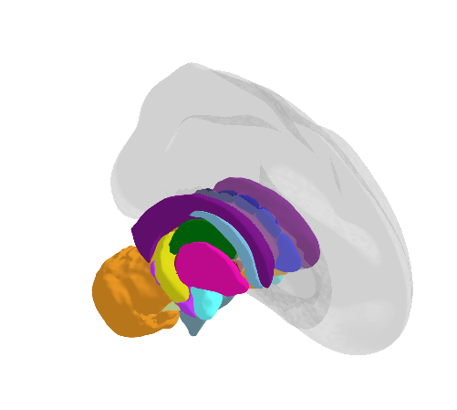

```{r setup, include=FALSE}
# Here you can place global options for the entire document.
# Mostly used for knitr settings, but can also load data etc.
# Whatever happens here will not show in the presentation.
knitr::opts_chunk$set(echo = TRUE,
                    out.width = "100%",
                    fig.retina = 3)

xaringanExtra::use_extra_styles(
  hover_code_line = TRUE
)

library(knitr)
library(dplyr)
library(kableExtra)
```


background-image: url("https://drmowinckels.io/about/profile.png")
background-position: right bottom
background-size: auto 100%
class: middle

.pull-left[
## Athanasia Monika Mowinckel

[<i class="fa-brands fa-mastodon fa-2x" aria-hidden="true"></i>&nbsp; https://fosstodon.org/@Drmowinckels](https://fosstodon.org/@Drmowinckels)

[<i class="fa-brands fa-github fa-2x" aria-hidden="true"></i>&nbsp;https://github.com/drmowinckels](https://github.com/drmowinckels) 

[<i class="fa-solid fa-globe fa-2x" aria-hidden="true"></i>&nbsp;https://drmowinckels.io/](https://drmowinckels.io/) 

- Staff scientist & RSE  
- PhD in cognitive psychology  
- Software Carpentry Instructor  

]


---
background-image: url(https://www.lifebrain.uio.no/vrtx/decorating/resources/images/logo.png), url(https://www.lifebrain.uio.no/web-banner_rev.jpg), url(https://www.lifebrain.uio.no/vrtx/decorating/resources/images/eu-flag.jpg)
background-size: 50%, 100% auto, 10%
background-position: 50% 10%, bottom center, 90% 10% 

---

layout: true

<div class="my-sidebar"></div> 

---
class: dark, center, middle

# Neuroimaging workflows

---
background-image: url(https://fsl.fmrib.ox.ac.uk/fsl/wiki_static/fsl/img/fsl-logo-x2.png), url(https://freesurfer2016.sciencesconf.org/conference/freesurfer2016/pages/FSlogo.png), url(https://nipype.readthedocs.io/en/latest/_static/nipype-banner-bg.png), url(https://www.mathworks.com/matlabcentral/mlc-downloads/downloads/98b0f6cf-f7e6-4051-b4f4-2aacf06f551b/a5cdc6ec-7ee3-4aaa-afbd-f283c68dd149/images/screenshot.png)
background-size: 20%, 40%, 50%, 20%
background-position: 20% 45%, 70% 45%, 85% 90%, 20% 95%

## MRI analyses are usually run in specialized software

???
- run in specialized software
- but results and dissemination is usually run in stats software
- switching between different software creates workflows that are hard to reproduce and keep track of

---
background-image: url(https://visceralmind.files.wordpress.com/2017/04/voxel-brain.jpg?w=1024)
background-size: contain

???
- the images are 3d matrices of 1mm cubic voxels, usually around 100 thousand voxels per brain
- MRI analyses run large numbers of comparisons just within a single subjects' brain, and issues with multiple comparisons need to be dealt with

---
background-image: url(https://www.researchgate.net/profile/Arno_Klein2/publication/233889622/figure/fig2/AS:271987822034957@1441858358467/Regions-in-the-DKT-cortical-labeling-protocol-Cortical-regions-of-interest-included-in.png)
background-size: contain

???
- To reduce this problem, the brain is often reduced to a smaller set of functionally or structurally meaningful parcellations
- here: the DK cortical atlas on an inflated brain (blown up like a balloon) to see also inside the grooves
- measurements are extracted from these regions for metrics like coritcal thickness, surface area, gyrification index etc. and used in statistical models

---
class: center, dark
background-image: url(img/ggseg.png), url(img/ggseg3d.png), url(img/ggsegExtra.png)
background-size: 15%
background-position: 41% 43%, 59% 43%, 50% 77%

# ggseg-suite

--

.pull-left[
  2d polygons / geospatial
]

--

.pull-left[
  3d mesh / tri-surface
]

--

<br><br><br><br><br><br><br><br><br>
<br><br><br><br><br><br><br><br><br>
atlas creation / installation

---
class: middle, center, dark
background-image: url(img/ggseg.png)
background-size: 18%
background-position: 50% 10%
# 
## Plotting 2d representations as polygons

---
class: middle

.pull-left[
```{r ggseg1, eval = FALSE}
library(ggplot2, quietly = TRUE)
library(ggseg, quietly = TRUE)

plot(dk, show.legend = FALSE)
```
]

.pull-right[
```{r, fig.height=4, ref.label="ggseg1", echo = FALSE}
```
]

---

## Using the core functionality


.pull-left[
```{r ggseg-new, eval=FALSE}
ggplot() + 
  geom_brain(atlas = dk, show.legend = FALSE)
```
]

.pull-right[
```{r, fig.height=4, ref.label="ggseg-new", echo = FALSE}
```
]

---

## Using the core functionality

.pull-left[
**Position options*
```{r ggseg-pos1, eval = FALSE}
ggplot() + 
  geom_brain(
    atlas = dk, 
    position = position_brain( #<<
      hemi ~ side #<<
      ), #<<
    show.legend = FALSE
  )
```
]

.pull-right[
```{r, fig.height=4, ref.label="ggseg-pos1", echo = FALSE}
```
]

---

## Using your own data

.pull-left[
```{r ggseg3_new, eval = FALSE}
library(dplyr)
someData <- tibble(
  region = rep(c("transverse temporal", 
             "insula",
           "precentral",
           "superior parietal"),2),
  p = sample(seq(0,.5,.001), 8),
  Group = c(rep("G1",4), rep("G2",4))) 

ggplot(data = someData) + 
  geom_brain(
    atlas = dk, 
    position = position_brain(side ~ hemi),
    colour = "black",
    mapping = aes(fill = p)) 
```
]

.pull-right[
```{r, fig.height=4, ref.label="ggseg3_new", echo = FALSE}
```
]

---

.pull-left[
## Faceting groups

```{r ggseg4, eval = FALSE}
someData %>% 
  group_by(Group) %>% #<<
  ggplot() + 
  geom_brain(
    atlas = dk, 
    position = position_brain(side ~ hemi),
    colour = "black",
    mapping = aes(fill = p)
  ) +
  facet_wrap(~Group, #<<
             nrow = 2) #<<
```
]

.pull-right[
```{r, fig.height=8, ref.label="ggseg4", echo = FALSE}
```
]

---

.pull-left[
## Adapting the look

```{r ggseg5, eval = FALSE}
someData %>% 
  group_by(Group) %>% 
  ggplot() + 
  geom_brain(
    atlas = dk, 
    position = position_brain(side ~ hemi),
    colour = "black",
    mapping = aes(fill = p)
  ) +
  facet_wrap(~Group, 
             nrow = 2) +
  theme(axis.text = element_blank(),
        axis.line = element_blank(),
        axis.ticks = element_blank(),
        axis.title = element_blank(), 
        panel.background = element_blank()
  ) +
  scale_fill_viridis_c(na.value = "grey62")
```
]

.pull-right[
```{r, fig.height=8, ref.label="ggseg5", echo = FALSE}
```
]


---
class: middle

.left-column[
## Subcortical atlases

```{r ggseg2, eval = FALSE}
plot(aseg)
```
]

.right-column[
```{r, fig.height=6, ref.label="ggseg2", echo = FALSE}
```
]


---
class: middle, center, dark
background-image: url(img/ggseg3d.png)
background-size: 18%
background-position: 50% 10%
# 
## Plotting 3d triangular meshes

---
class: middle

.pull-left[
## Powered by plotly
### Fully interactive
```{r ggseg3d-1, eval = FALSE}
library(ggseg3d)
ggseg3d(atlas = dk_3d)
```
]

.pull-right[
```{r, fig.height=5, ref.label="ggseg3d-1", echo = FALSE, warning=FALSE, message=FALSE}
```
]

---
class: middle

.pull-left[
## subcortical structure
### with glass brain for reference
```{r ggseg3d-2, eval = FALSE}
ggseg3d(atlas = aseg_3d) %>% 
  add_glassbrain(hemisphere = "left") %>% 
  remove_axes()
```
]

.pull-right[
```{r, echo = FALSE}

```
]

---
class: middle, center, dark
background-image: url(img/ggsegExtra.png)
background-size: 18%
background-position: 50% 10%
# 
## Creating and instaling atlases


---


.pull-left[
# Many compatible atlases

Can all be found in the ggseg r-universe

https://ggseg.r-universe.dev/builds

```{r}
library(ggsegExtra)
repos <- ggseg_atlas_repos()
```
]

.pull-right[
```{r, echo = FALSE, message=FALSE}
repos %>% 
  select(Package, Version) |> 
  filter(!Package %in% c("freesurfer", "ggseg", "ggseg3d", "ggsegExtra")) |> 
  kable(format = "html") %>% 
  kable_styling()
```
]

---


.pull-left[

```{r, eval = FALSE}
install_ggseg_atlas("LCBC-UiO/ggsegYeo2011")
install_ggseg_atlas("LCBC-UiO/ggsegAal")
```


```{r "yeo", eval=FALSE}
library(ggsegYeo2011)
library(ggsegAal)

plot(yeo7, 
     position = position_brain(hemi ~ side))

plot(aal, 
     position = position_brain(hemi ~ side))
```
]

.pull-right[
```{r "yeo.out", echo = FALSE, ref.label="yeo", fig.height=4}
```
]


---
class:dark, middle, center

# Check out the online package docs

Here you can find tutorials and more in-depth descriptions
of what you can accomplish with the packages.

## [ggseg](https://lcbc-uio.github.io/ggseg/index.html)  
## [ggseg3d](https://lcbc-uio.github.io/ggseg3d/index.html)  
## [ggsegExtra](https://lcbc-uio.github.io/ggsegExtra/index.html)  


---
class: center, dark
background-image: url(img/ggseg.png), url(img/ggseg3d.png), url(img/ggsegExtra.png)
background-size: 15%
background-position: 41% 43%, 59% 43%, 50% 77%

# ggseg-suite

.pull-left[
  2d polygons / geospatial
]


.pull-left[
  3d mesh / tri-surface
]

<br><br><br><br><br><br><br><br><br>
<br><br><br><br><br><br><br><br><br>
atlas creation / installation


---
class: title-slide, middle, right

# Thanks to our lab 
# for funding to develop 
# these tools

[oslobrains.no](https://www.oslobrains.no/)
