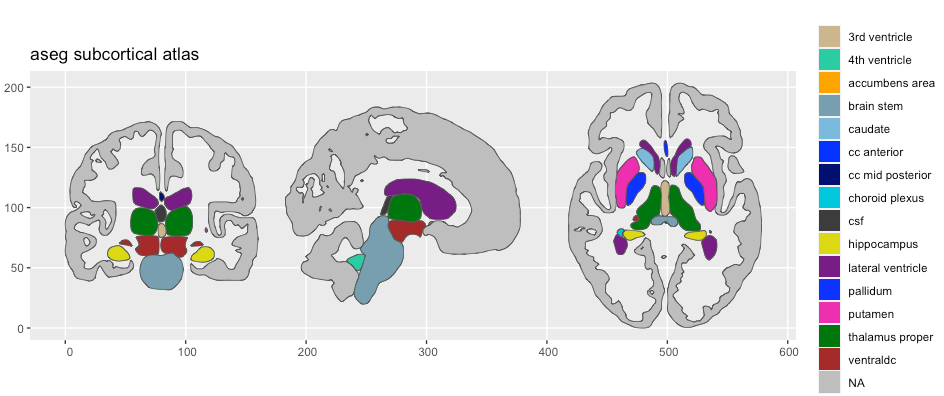

```{r setup, include=FALSE}
# Here you can place global options for the entire document.
# Mostly used for knitr settings, but can also load data etc.
# Whatever happens here will not show in the presentation.
knitr::opts_chunk$set(echo = TRUE,
                    out.width = "100%",
                    fig.retina = 3)

xaringanExtra::use_extra_styles(
  hover_code_line = TRUE
)

library(knitr)
library(dplyr)
library(kableExtra)
```

layout: true

<div class="my-sidebar"></div> 

---
background-image: url(https://fsl.fmrib.ox.ac.uk/fsl/wiki_static/fsl/img/fsl-logo-x2.png), url(https://freesurfer2016.sciencesconf.org/conference/freesurfer2016/pages/FSlogo.png), url(https://nipype.readthedocs.io/en/latest/_static/nipype-banner-bg.png), url(https://www.mathworks.com/matlabcentral/mlc-downloads/downloads/98b0f6cf-f7e6-4051-b4f4-2aacf06f551b/a5cdc6ec-7ee3-4aaa-afbd-f283c68dd149/images/screenshot.png)
background-size: 20%, 40%, 50%, 20%
background-position: 20% 45%, 70% 45%, 85% 90%, 20% 95%

## MRI analyses are usually run in specialized software

???
- run in specialized software
- but results and dissemination is usually run in stats software
- switching between different software creates workflows that are hard to reproduce and keep track of

---
background-image: url(https://visceralmind.files.wordpress.com/2017/04/voxel-brain.jpg?w=1024)
background-size: contain

???
- the images are 3d matrices of 1mm cubic voxels, usually around 100 thousand voxels per brain
- MRI analyses run large numbers of comparisons just within a single subjects' brain, and issues with multiple comparisons need to be dealt with

---
background-image: url(https://www.researchgate.net/profile/Arno_Klein2/publication/233889622/figure/fig2/AS:271987822034957@1441858358467/Regions-in-the-DKT-cortical-labeling-protocol-Cortical-regions-of-interest-included-in.png)
background-size: contain

???
- To reduce this problem, the brain is often reduced to a smaller set of functionally or structurally meaningful parcellations
- here: the DK cortical atlas on an inflated brain (blown up like a balloon) to see also inside the grooves
- measurements are extracted from these regions for metrics like coritcal thickness, surface area, gyrification index etc. and used in statistical models

---
class: center, dark
background-image: url(img/ggseg.png), url(img/ggseg3d.png), url(img/ggsegExtra.png)
background-size: 15%
background-position: 41% 43%, 59% 43%, 50% 77%

# ggseg-suite

.pull-left[
  2d polygons <br> 
  geospatial
]

--

.pull-left[
  3d mesh <br> 
  tri-surface
]

--

<br><br><br><br><br><br><br><br><br>
<br><br>
atlas creation / installation

---
class: middle, center, dark
background-image: url(img/ggseg.png)
background-size: 18%
background-position: 50% 10%
# 
## Plotting 2d representations as polygons

---
class: middle

.pull-left[
```{r ggseg1, eval = FALSE}
library(ggplot2, quietly = TRUE)
library(ggseg, quietly = TRUE)

plot(dk, show.legend = FALSE)
```
]

.pull-right[
```{r, fig.height=4, ref.label="ggseg1", echo = FALSE}
```
]

---

## ggseg - 2d polygons

.pull-left[
```{r ggseg-pos2, eval = FALSE}
ggplot() + 
  geom_brain(
    atlas = dk, 
    position = position_brain(side ~ hemi),
    show.legend = FALSE
  )
```
]

.pull-right[
```{r, fig.height=4, ref.label="ggseg-pos2", echo = FALSE}
```
]

---
class: middle, center, dark
background-image: url(img/ggseg3d.png)
background-size: 18%
background-position: 50% 10%
 
## Plotting 3d triangular meshes

---
class: middle

.pull-left[
## Powered by plotly
### Fully interactive
```{r ggseg3d-1, eval = FALSE}
library(ggseg3d)
ggseg3d(atlas = dk_3d)
```
]

.pull-right[
```{r, fig.height=5, ref.label="ggseg3d-1", echo = FALSE, warning=FALSE, message=FALSE}
```
]

---

.pull-left[
### Problem
current solution creates one mesh object _per_ atlas segment
- DK: 90 mesh objects x 3 surfaces
- Glasser: 395 mesh objects x 3 surfaces

Creates slow plotting and large packages.
]

.pull-right[
### Solution
New system colours the vertices directly
- reduced size through only storing vertex index and colour
- ggseg3d alone needs to store the mesh objects for all other atlases to use
]

---

.pull-left[
```r
dk
dk_3d
```
]

.pull-right[
- current format needs to data objects for an atlas:
  - 3d-version
  - 2d version

problem:
  -   hard for users to remember and understand

solution:
  - new system can deal with both data in a single object
]

---
class: middle, center, dark
background-image: url(img/ggsegExtra.png)
background-size: 18%
background-position: 50% 10%

## Creating and installing atlases


---

## Atlases
```{r, include=FALSE}
library(ggsegExtra, quietly = TRUE)

atlases <- ggseg_atlas_repos() |> 
  filter(!Package %in% c("ggseg", "ggsegExtra", "ggseg3d", "freesurfer")) |> 
  mutate(
    img = sprintf(
      '',
            RemoteUrl, Package)
  ) |> 
  pull(img)
```

```{r, echo = FALSE, results='asis'}
cat(atlases)
```

---

# Making cortical atlases

.pull-left[
## Old way 
```{r, eval = FALSE}
# Make brain atlases into
# 3d plotly mesh atlas
dt3d <- make_aparc_2_3datlas(
  annot = "aparc.a2009s"
)

# Turn plotly mesh atlas
# into 2d polygon atlas
dt2d <- make_ggseg3d_2_ggseg(dt3d)
```


]

.pull-right[
## New way 
```{r, eval = FALSE,  fig.height=6}
dt <- make_ggseg_aparc(
  annot = "aparc.a2009s"
)
```
]

???
Here is an example of the HCP Glasser atlas

---

# Creating new subcortical atlases
## Still needs old system

.pull-left[
```{r, eval = FALSE}
# Make brain atlas image into
# 3d plotly mesh atlas
make_volumetric_2_3datlas()

# Make brain atlas image into
# into 2d polygon atlas
make_volumetric_ggseg()
```
]

.pull-right[
```{r, echo = FALSE,  out.width='100%'}

```
]

???
Here is an example of a pipeline to make
the aseg subcortical atlas with the functions. 
This was made entirely through R, but 
with function calls from within R to 
FreeSurfer and ImageMagick.

---
class: center, dark, bottom

# New vectorised solution coming this fall

--

faster

--

more unified

--

easier to make new atlases

